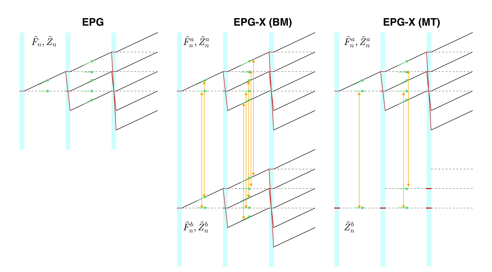

# EPG-X
An Extended Phase Graph (EPG) approach for modelling of MRI sequences for systems with Magnetization Transfer or Chemical Exchange.

The EPG algorithm is extended to coupled exchanging systems that are:

1. governed by the Bloch-McConnell equations (BM) or
2. described by the 'binary spin bath' model for pulsed magnetization transfer (MT).

The theory is described in [**this paper**](http://github.com/mriphysics) . Essentially a two compartment system is modelled by describing each compartment with a separate EPG calculation. The operators governing evolution periods between RF pulses are updated to include exchange between compartments. For the MT case the second compartment consists only of longitudinal states. Although only two compartment systems are handled by this code, the method is in principle straightforward to extend.

Shaihan Malik, King's College London, July 2017.
[@shaihanmalik](https://twitter.com/shaihanmalik)

## Example calculations

The EPG-X source code in this repository is completely general and can be adapted for modelling of a wide range of MR sequences. Functions have explicitly been written to simulate two commonly modeled sequence types: rapid gradient echo (including SPGR and bSSFP) and turbo spin echo (see descriptions of functions, below)

Four separate example scripts are given in the top directory; these may be used for reproducing the four experiments presented in **this paper**.

* **Experiment 1** ( `expt1_steady_state_GRE.m`)

  Compares the steady-state found by EPG-X calculation with direct steady-state calculations for which solutions exist. Examples are given for SPGR and bSSFP sequences.
 - The transient phase of SPGR is considered
 - SPGR signal vs RF spoiling phase increment also included

* **Experiment 2** ( `expt2_multislice_TSE.m`)

  Compares single slice and multi-slice TSE for a system with MT effects. In the multi-slice case the excitation of other slices creates off-resonant saturation of the bound pool magnetization in the local slice, leading to signal attenuation when compared with the single slice case.

* **Experiment 3** (`expt3_transient_GRE.m`)

  Simulates balanced SSFP and SPGR sequences with variable flip angles following an inversion pulse, for a system with MT effects. This type of sequence has been proposed for use in Magnetic Resonance Fingerprinting (MRF) - the experiment explores the possible influence of MT on this method.

* **Experiment 4** (`expt4_multicomponent_CPMG.m`)

  Simulates multiecho CPMG sequence for two compartment system coupled by chemical exchange (follows Bloch-McConnell equations). This type of measurement is used for multicomponent T2 estimation - the simulation explores how exchange can influence the estimated parameters

## Detailed description of implementations

The EPG-X code is contained in subfolder `EPGX-src`. The code efficiently implements EPG and EPG-X using Matlab sparse matrices; this has been found to be very efficient. The current state is stored in a vector arranged as follows:

* EPG:      `[F0 F0* Z0 F1 F-1* Z1 F2 F-2* Z2 ... ]^T`

* EPG-X(MT) *pulsed MT version*

  `[F0A F0A* Z0A Z0B F1A F-1A* Z1A Z1B F2A F-2A* Z2A Z2B ... ]^T`

    i.e. There are Z states for both compartments but F states only for compartment A (4 states per 'order')

* EPG-X(BM) *Full Bloch-McConnell version*

  `[F0A F0A* Z0A F0B F0B* Z0B F1A F-1A* Z1A F1B F-1B* Z1B F2A F-2A* Z2A F2B F-2B* Z2B ... ]^T`

  there are six states per EPG order

For two compartment simulations compartment A is taken to be the larger one (for MT this is the free pool). There are six major simulation functions:

* `EPG_GRE.m`

  Classic EPG simulation code for gradient echo sequences. Arguments:
  - `theta` - series of flip angles (rad)
  - `phi` - series of RF pulse phases (rad)
  - `TR` - repetition time (ms)
  - `T1` - T1 (ms)
  - `T2` - T2 (ms)
  Different flavours of sequence can be defined by setting `phi`: alternating 0,180 gives bSSFP; quadratic progression for SPGR. Function `RF_phase_cycle.m` can be used to set this.

* `EPGX_GRE_MT.m`

  EPG-X(MT) GRE simulation. Same syntax as `EPG_GRE.m` with additional arguments:
  - `B1SqrdTau`: the integrated square amplitude of each RF pulse, units uT^2 ms
  - `f`: *smaller* pool fraction (for MT this is the bound pool)
  - `ka`: Exchange rate from compartment A to B. Units s^-1
  - `G`: Absorption line value at the frequency of interest; this does not necessarily have to be zero, it depends on the pulse being simulated. Units us (microseconds)

  In addition the T1 argument now takes two values (compt. A and B)

* `EPGX_GRE_BM.m`

    EPG-X(BM) GRE simulation. As above, but both T1 and T2 have two components, and the RF power and absorption line value are not needed.

    Signal returned is the sum of both compartments

* `EPG_TSE.m`

    Classic EPG simulation code for TSE sequences. Arguments:
    - `theta` - series of flip angles (rad); can be complex if phase modulation also needed
    - `ESP` - echo spacing time (ms)
    - `T1` - T1 (ms)
    - `T2` - T2 (ms)

  * `EPGX_TSE_MT.m`

    EPG-X(MT) TSE simulation. Same syntax as `EPG_TSE.m` with additional `B1SqrdTau`, `f`, `ka` & `G` as defined above

  * `EPGX_TSE_BM.m`

    EPG-X(BM) TSE simulation. As above but T1 and T2 both have two compartments and RF saturation parameters are not needed.

#### Implementation of shift operators

Shifts have been implemented using matrices that are defined by separate functions `EPG_shift_matrices.m`, `EPGX_MT_shift_matrices.m` and `EPGX_BM_shift_matrices.m`. They increase the index (k-value) of each F state and map Z states to themselves. They are efficiently defined using matlab sparse matrices.

#### 'kmax' variable

All functions have an optional variable `kmax`. This sets the maximum order of EPG that is included in the calculation.  Reducing will lead to smaller matrices and hence faster operation. The maximum k-value is also varied throughout the sequence in order to exclude states that will not contribute to the signal. See the appendix to [**this paper**](http://dx.doi.org/10.1002/mrm.24153) and supporting information to [**this one**](http://dx.doi.org/10.1002/mrm.25192) for more detail.

#### Diffusion
Diffusion effects are easily integrated into the EPG framework - see [this paper by Weigel et al](http://dx.doi.org/10.1016/j.jmr.2010.05.011) for detailed information. These are efficiently implemented in the code by combining the diffusion, relaxation (& exchange) and shift operators. The functions `Xi_diff_BM` and `Xi_diff_MT` are coded efficiently to do this. The code is hard to read but effectively creates band diagonal matrices directly using matlab `spdiags` function. For the 'classic' EPG code, the function `E_diff` combines diffusion and relaxation in the same way - this is simpler as the matrix is diagonal.

The code requires a structure 'd' that contains the diffusion coefficient, gradient strengths and durations:

    d = struct;
    d.D = 2.3e-9; %<- diffusion coeff in m^2/s
    d.G = [-5.9 4.5 12]; % Gradient values, mT/m
    d.tau = [1.4 6.6 3]; % Duration of each segment, ms

The gradient and duration values summarise the gradient activity during each TR period. This can be a single value/duration pair, or could in principle represent shaped gradients by containing a list of hundreds of temporal samples. We have used three values for the gradient pre-winder, readout, and spoiler.

#### Prep pulses
The gradient echo simulation functions `EPG_GRE`, `EPGX_GRE_BM` and `EPGX_GRE_MT` all have the optional variable 'prep'. This can be used to add an inversion (or other) pre-pulse prior to the GRE segment. Note that the pulse is assumed to be well spoiled - only the effect on longitudinal magnetization is considered. The argument will be a structure 'prep' with the following fields:

    prep = struct;
    prep.flip=pi;   % flip angle, radians
    prep.t_delay=0; % delay until start of GRE, ms
    prep.B1SqrdTau=433; % Only needed for MT version - RF energy in prep pulse, units uT^2 ms

#### 'zinit'
Functions `EPG_TSE` and `EPGX_TSE_MT` have additional optional variable `zinit`. This can be used to specify the starting longitudinal magnetization Z0, which would otherwise be M0, or [M0a M0b]. This is used for experiment 2 - multi-slice TSE - which chains multiple simulations together. Only the Z0 states are assumed to be carried over between runs.
